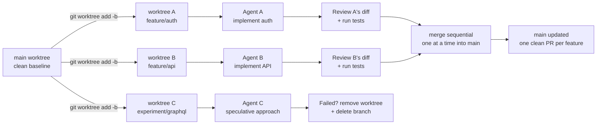

# 16. Git Worktrees and AI — Parallel Feature Development (How We Build)

**Target:** Principal Software Engineer V — The Standard (IBTE)
**Type:** Supporting topic — the execution engine detail behind the AI SDLC story (companion to talks/14)

---

## Question This Answers

**Interviewer:** "You said you run multiple AI agents. How do you actually keep them from stepping on each other? If three agents are working on the same repository, how do you prevent one from overwriting the other's work?"

---

## Answer

> "The same way I keep human engineers from stepping on each other — isolation at the branch level. Each AI agent gets its own git worktree: its own checked-out directory, its own branch, its own index, all sharing one repository's history and object store. The agents never see each other's working files, so they physically cannot overwrite each other's changes mid-flight.
>
> The pattern is one worktree per agent task. I create the worktree on a clean baseline, run the test suite to prove it's green, hand it to the agent, and while that agent works I review another agent's output — I stop being the person waiting for code and start being the person directing parallel work.
>
> The hard part isn't the isolation, it's the recombination. Conflicts don't disappear — they move to merge time, where git's existing tooling detects them instead of agents silently corrupting each other's state. I merge sequentially, one worktree at a time, or rebase each branch onto main before its PR. And failed experiments cost nothing — a speculative approach gets its own worktree, and if it doesn't pan out I delete the directory and the branch in one command, with zero pollution of the main codebase.
>
> That's why I use it for every project now. For a human, worktrees remove the stash-and-switch tax of context switching. For AI agents, they remove the four failure modes that kill multi-agent work: silent file overwrites, context contamination, git lock contention, and agents building on stale code. The tool itself is ten years old — Git 2.5 shipped it in 2015 — but AI agents turned it from a nice-to-have into the standard way to run parallel work."

---

## Structure

| Section | Content | Time |
|---|---|---|
| Thesis | Isolation at the branch level — one worktree per agent | ~5 sec |
| The mechanism | Own directory, branch, index; shared history and object store | ~10 sec |
| The workflow | Clean baseline → green test suite → hand to agent → review in parallel | ~10 sec |
| The hard part | Recombination — conflicts deferred to merge time, merge sequentially / rebase before PR | ~10 sec |
| Why it matters | Four multi-agent failure modes eliminated; experiments cost nothing | ~10 sec |
| The twist | Ten-year-old Git feature (2015) that AI made essential | ~5 sec |

---

## The Verified Facts

### What a worktree is

`git worktree` lets one repository have multiple working directories attached to it. Each linked worktree has its own `HEAD`, its own index (staging area), and its own working files — but all worktrees share the single `.git` object database, refs, config, and remotes. Storage cost scales with working-file count, not history size; creating a worktree is faster than cloning because it shares existing objects.

| Resource | Per-Worktree (private) | Shared across all worktrees |
|---|---|---|
| HEAD | ✅ each has its own | |
| Index (staging area) | ✅ each has its own | |
| Working directory files | ✅ each has its own | |
| Object store (commits/blobs) | | ✅ single shared store |
| Refs (branches) | | ✅ shared |
| Remotes / config | | ✅ shared |

History: `git worktree` landed in **Git 2.5, July 29, 2015** (major contributor Nguyễn Thái Ngọc Duy). Git 2.7 added `worktree move`/`remove`; Git 2.15 added `worktree lock`/`unlock`. It spent a decade as a "great if you know it" feature until AI agents made it essential.

### The four failure modes it prevents (Augment Code, Apr 2026)

| Failure mode | Detection without worktrees | Impact |
|---|---|---|
| Concurrent file overwrites | Undetected until compile/runtime | Silent data loss |
| Context contamination | No signal to affected agent | Decisions based on stale codebase view; cascading breakage |
| Race conditions on shared state | Silent; agents proceed on stale data | Corrupted build artifacts and test state |
| Git lock contention (`.git/index.lock`) | Immediate, but blocks all agents | System-wide git freeze until manual `rm` |

Key insight: agents **do not notice** when they collide — they proceed silently on corrupted data rather than surfacing an exception. Worktrees convert invisible runtime corruption into standard git conflicts that existing tooling detects and resolves.

### The core commands

```bash
# One worktree per agent task, each on its own branch
git worktree add -b feature/auth ../project-auth main
git worktree add -b feature/api ../project-api main

# List all active worktrees
git worktree list

# Clean baseline check before handing to an agent
npm lint && npm test    # prove green BEFORE the agent starts

# After the agent finishes — same suite, attributable failures
git diff                # review
npm test                # any new failure is the agent's, not pre-existing

# Merge sequentially, one at a time
git checkout main && git merge --no-ff feature/auth
git merge --no-ff feature/api

# Failed experiment? Delete directory + branch in one command
git worktree remove ../project-experiment
git branch -D experiment/new-approach
git worktree prune      # clears stale metadata
```

### Agent-specific commands (Claude Code)

Claude Code added an official `--worktree` flag (Feb 2026), making the pattern first-class:

```bash
# Create worktree + branch + start a Claude session inside it, in one command
claude --worktree feature-auth
```

- Creates `.claude/worktrees/<name>/` (nested layout, add to `.gitignore`), branches from the default remote branch
- No changes on exit → worktree and branch auto-removed; changes exist → prompts keep or remove
- Subagent-level directive: `isolation: worktree` in a subagent's frontmatter provisions a fresh worktree per parallel invocation, cleaned up on finish — a top-level session can delegate to 4–5 parallel sub-agents each with filesystem isolation, with no manual worktree management

### Throughput math (understandingdata.com)

Sequential: features take 2h + 1.5h + 1h = **4.5h** → 0.67 features/hour.
Parallel (worktrees): max(2h, 1.5h, 1h) = **2h** → 1.5 features/hour = **2.25× faster**, before counting speculative work (trying 3 API designs at once) or A/B implementations. Industry benchmarks cited for worktree-based parallel CI: 63% build-time reduction (24 min → 9 min).

### Real-world adoption

- **incident.io** runs 4–5 parallel Claude agents routinely; a single `w` bash function spawns an isolated session per task name; one $8 Claude credit bought an 18% build-time improvement on a deprioritized API-generation effort
- **Cursor 2.0** (Oct 2025): up to 8 concurrent agents, each in independent workspaces via worktrees
- **Spec-Kitty** pairs spec-driven development (the talks/14 theme) with worktrees + auto-merge across Claude/Cursor/Gemini/Codex
- **ccswarm**: open-source multi-agent orchestration using Claude Code with worktree isolation and specialized agent pools
- One practitioner reported scaling to **371 worktrees** for multi-agent work (anecdotal, but indicative)

### The gotchas to name unprompted (shows depth)

1. **Worktrees don't solve overlap** — do not parallelize tasks that edit the same files; conflicts still exist, they just surface at merge time. Split work along sane module boundaries.
2. **Port collisions** — dev servers default to the same ports (3000, 8080); use per-worktree port offsets or run one server at a time.
3. **Dependencies are per-worktree** — `node_modules`/`.venv` must be installed in each worktree; heavy projects consume disk fast.
4. **`.env` is not copied** — symlink it from the main worktree so updates propagate (`ln -s $(pwd)/.env trees/feature-auth/.env`).
5. **Same branch can't be checked out in two worktrees** — intentional safeguard; use `-b` new branches or `--detach`.
6. **`git worktree prune`** after manual directory deletion, or stale metadata clutters the list.

---

## The Workflow Diagram



---

## How It Maps to Your Other Stories

| Story | The Worktree Connection |
|---|---|
| **AI-DLC / Kiro (talks/14)** | The same isolation discipline: agents execute tasks one by one, each in its own branch — worktrees are how "agents execute the task list" happens without collisions |
| **Enterprise AI Governance (talks/15)** | Worktrees are the enforcement layer for the *first rule* — scoped permissions. Each agent gets a scoped filesystem it physically cannot exceed, plus a natural audit boundary (one branch per task = one PR per task = one auditable unit) |
| **Spec-driven migration (Dish)** | Spec → decomposed task list → each task fanned out to a worktree = parallel modernization with merge-time integration, exactly how a 80+ API migration can run concurrently |
| **Sling TV UMS migration** | Parallel-run validation: multiple worktrees running old vs new behavior side by side, comparing without contaminating each other |
| **Defect-fixing skills** | One worktree per defect contract; hooks validate; human reviews the PR — the defect fix pipeline at scale |
| **Personal projects (GCP/Firebase POC, memory systems)** | Every project runs this way — the POC loop and the memory-system build both used one-worktree-per-feature with AI agents |

## Key Signals

- **Distributed-systems mindset applied to engineering process:** "agents reproduce concurrency problems from distributed systems — and worse, they don't notice when something goes wrong." That framing is the Principal-level insight
- **Knows the tool's history:** "Git 2.5, July 2015 — ten years old, AI made it essential" — shows depth beyond the buzzword
- **Names the hard part unprompted:** recombination, not isolation. Merging sequential, rebase-before-PR, pre-merge conflict detection — this is the sign of someone who has actually run the workflow and hit the wall
- **Honest about limits:** "worktrees don't solve overlapping changes — split work along module boundaries" — no overselling
- **Operational details:** port offsets, symlinked `.env`, per-worktree deps, `prune` — hands-on fluency
- **Verification discipline:** clean baseline → green suite → hand to agent → same suite after → attributable failures. This matches the "tests both ways" theme from talks/15

## Delivery Tips

- **Lead with the physical image:** "own directory, own branch, own index — they literally cannot see each other's files." Make the isolation tangible before the theory
- **"The hard part isn't isolation, it's recombination"** — this is your strongest line. It preempts the obvious follow-up ("but what about merge conflicts?") and shows you've actually run it
- **Name the four failure modes as a list** — file overwrites, context contamination, lock contention, stale-code builds. Lists land
- **One concrete number:** 2.25× throughput on three parallel features — math you can do on a napkin is more credible than a slide
- **Connect to governance:** in a regulated environment, one-worktree-per-task = one-branch-per-task = one-PR-per-task = clean audit trail. This ties directly to the insurance story
- **The $8 / 18% incident.io anecdote** is a good close if the interviewer wants proof the pattern pays for itself

## Follow-Up Questions

- **"Doesn't this just create more merge conflicts?"** — It moves conflicts from invisible to visible. Without worktrees, two agents overwrite the same file silently and you find out at runtime. With worktrees, conflicts surface at merge time where git's standard tooling detects and resolves them. And you reduce them structurally: split tasks along module boundaries, merge sequentially, rebase before PR.
- **"What if two agents need to touch the same file?"** — Then they shouldn't run in parallel on that file. The decomposition step decides boundaries: if two tasks share a module, I serialize them or pre-agree the interface contract before either starts. Worktrees are an isolation primitive, not a license to ignore coupling.
- **"Is this only for AI agents?"** — No — it's great for humans too. It kills the stash-and-switch tax of context switching. But humans can hold one context at a time, so worktrees were a productivity nicety. Agents changed the economics: an agent works for 30 minutes unattended, so running five of them in parallel is free parallelism. That's why the tool went from nice-to-have to essential.
- **"How do you know an agent didn't break something?"** — Baseline-first: run lint and the test suite the moment the worktree is created, prove it's green, then hand it to the agent. When the agent finishes, run the same suite again — any new failure is attributable to the agent's changes. Same discipline as the "tests both ways" rule in my governance story.
- **"What does this have to do with insurance?"** — Auditable, reversible, isolated change. In a regulated environment, one worktree per task gives you a clean unit of work: one branch, one PR, one review, one approval, one audit entry. Speculative or failed work is deleted with its branch — nothing half-finished ever lands in the mainline. That's the traceability a compliance team can actually inspect.

## Notes

- This is the **execution-layer companion to talks/14** — Kiro/AI-DLC says *what* the process is; this doc says *how agents physically run in parallel without colliding*. Use them as a pair: 14 for the methodology, 16 for the isolation mechanics
- Sources (verified 2026-08-01): [Augment Code — How to Use Git Worktrees for Parallel AI Agent Execution](https://www.augmentcode.com/guides/git-worktrees-parallel-ai-agent-execution), [Zylos — Git Worktree Isolation Patterns for Parallel AI Agent Development](https://zylos.ai/research/2026-02-22-git-worktree-parallel-ai-development/), [Kendrick B. Jung (dev.to) — Using git worktree for parallel AI agent development](https://dev.to/sonim1/using-git-worktree-for-parallel-ai-agent-development-44nb), [James Phoenix — 3x Throughput with AI Agents](https://understandingdata.com/posts/git-worktrees-parallel-dev/), [Git docs — git-worktree](https://git-scm.com/docs/git-worktree)
- The Git 2.5 / 2015 origin and the Feb 2026 Claude Code `--worktree` flag are the two dates worth remembering; both verified against the dev.to article
- Your own harness (Paseo/omp) runs exactly this pattern — `task` with `isolated: true` provisions a per-agent worktree, and the Paseo worktree lifecycle skill documents real cleanup behavior (worktrees vanish between sessions). If an interviewer asks "have you actually done this?" the honest answer is: this is how my own projects run today
- Be careful not to overclaim org-scale use at Dish — this is your personal-project pattern. If asked, frame it as: "this is how I run my own projects; here's how I'd scale it to a team" — the scaling discussion (merge sequencing, conflict pre-detection, port/dep management) is where the Principal thinking shows
