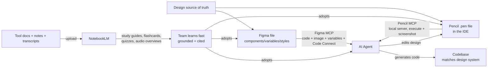

# 29. Team AI Enablement — Figma MCP, Pencil MCP, and NotebookLM (How We Learn and Adopt)

**Target:** Principal Software Engineer V — The Standard (IBTE)
**Type:** Supporting topic — the adoption/enablement layer of the AI toolchain (companion to talks/14, 15, 16)

---

## Question This Answers

**Interviewer:** "You keep talking about agents, MCP, worktrees — that's a lot of new tooling. How do you actually get a team to adopt this? Doesn't the learning curve kill it?"

---

## Answer

> "Adoption fails when the tool is technically right but the team can't see the payoff, or can't climb the learning curve. So I treat enablement as an engineering problem with two variables: reduce the friction to first value, and reduce the cost of learning.
>
> The friction side is context. Agents are only as good as what they can see. I introduced Figma's MCP server so our agents pull live design context — components, variables, styles — straight from the design file instead of guessing from a screenshot. Code Connect maps a Figma component to the exact code file path, so generated code matches the fingerprint of our codebase and our design system at the same time. And Pencil, the design-in-IDE tool, gives engineers a canvas where an agent can read and edit the design directly — with the MCP server running locally, so nothing leaves the machine. Design stops being a handoff artifact and becomes live context agents can work against.
>
> The learning side is where NotebookLM comes in. When we roll out a new tool, I feed it the documentation, architecture notes, and even meeting transcripts, and it produces study guides, flashcards, quizzes, and audio overviews — all grounded in our sources with citations. The team ramps in days instead of weeks, on their own schedule, without a day of slideware.
>
> The pattern underneath all of this: MCP is the standard socket, so I plug tools in instead of building custom integrations. And every adoption story gets the same three steps — prove it on real work, make it part of the existing workflow, and make learning cheap. The tools change; the enablement playbook doesn't."

---

## Structure

| Section | Content | Time |
|---|---|---|
| Thesis | Adoption = reduce friction to first value + reduce learning cost | ~5 sec |
| The friction fix | Figma MCP: live design context (components, variables, styles) + Code Connect → code matches codebase AND design | ~10 sec |
| The in-IDE design fix | Pencil (pen.dev): agent reads/edits `.pen` design in the IDE; local MCP server, no cloud | ~10 sec |
| The learning fix | NotebookLM: docs/notes → study guides, flashcards, quizzes, audio — grounded in your sources | ~10 sec |
| The pattern | MCP = standard socket; three-step enablement playbook (prove → integrate → make learning cheap) | ~10 sec |
| The close | Tools change, playbook doesn't | ~5 sec |

---

## The Verified Facts

### Figma MCP server (beta announced June 4, 2025)

Figma's MCP server brings design context directly into agentic coding tools (Copilot in VS Code, Cursor, Windsurf, Claude Code). Announced as beta by Figma on June 4, 2025, it exposes three context tools plus Code Connect:

| Capability | What it gives the agent |
|---|---|
| **Code tool** | React/Tailwind code representation of the selection; Code Connect surfaces the exact code file path for a component |
| **Image tool** | Screenshots of the design — high-level flow and visual intent, not just metadata |
| **Variables tool** | Variable definitions with code syntax — the exact token name, not "a red rectangle" |
| **Code Connect** | Component → code mapping: agent goes straight to the right file instead of searching or inventing a new component |

Figma's framing: "the right code is aligned to design intent, not just pixels" — screenshots + code outputs perform better than either alone. Access: Dev or Full seat; a remote server (all seats/plans) and desktop server (Dev/Full) are now available; clients must be in the Figma MCP Catalog (VS Code, Cursor, Claude Code).

Sources: [Figma blog — Introducing our MCP server (June 4, 2025)](https://www.figma.com/blog/introducing-figma-mcp-server/), [Figma developer docs — Figma MCP server](https://developers.figma.com/docs/figma-mcp-server/), [Figma help — Guide to the Figma MCP server](https://help.figma.com/hc/en-us/articles/32132100833559-Guide-to-the-Figma-MCP-server), [Design Systems and AI: Why MCP Servers Are The Unlock](https://www.figma.com/blog/design-systems-ai-mcp/)

### Pencil (pen.dev) MCP — design in the IDE

Pencil is an engineer-facing design tool: "bringing designing directly into your preferred IDE." Its built-in MCP server runs **locally** when Pencil is running — no cloud dependency, design files stay on the machine.

| Fact | Detail |
|---|---|
| Supported assistants | Claude Code (CLI + IDE), Claude Desktop, Cursor, Windsurf, Codex CLI, Antigravity, OpenCode |
| Core MCP tool: `execute` | Create/modify/manipulate design elements; read node hierarchy; set variables and themes; generate and place images |
| Analysis tools | `get_screenshot` (render previews, verify visual output, compare before/after), `get_app_state` (selection, active file) |
| Design systems | "Ensure all buttons use the primary color variable", "Apply 8px spacing grid", typography scales — variables/themes read and written via MCP |
| Code integration | "Generate React code for this component", "Create Tailwind config from these variables" |
| Guardrail | "AI suggests, you approve" — human stays in control; local-only server, no remote access |

There is also an open-source fork, OpenPencil (`@open-pencil/mcp`), with the same architecture: MCP HTTP server on port 7600 + WebSocket bridge (7601) into the editor, plus ACP support for local CLI agents.

Sources: [pen.dev docs — AI Integration](https://docs.pen.dev/getting-started/ai-integration), [OpenPencil — MCP Server and ACP Agents (DeepWiki)](https://deepwiki.com/open-pencil/open-pencil/4.3-mcp-server-and-acp-agents)

### NotebookLM — the learning accelerator

Google's NotebookLM is a research/learning assistant grounded in sources you upload (PDFs, Google Docs, slides, web URLs, YouTube). For team enablement it collapses the cost of ramping on new tooling:

| Feature | How it simplifies learning |
|---|---|
| **Study guides / Learning Guide** | Turns docs into guided study material instead of passive reading |
| **Flashcards & quizzes** | Auto-generated from the material; difficulty levels; citations back to source |
| **Audio Overviews** | Podcast-style discussion of the sources — learn on a commute |
| **Video Overviews / Mind Maps** (2025) | Visual summaries of document content |
| **Grounded answers** | Responses cite the exact source passages — no hallucinated tool advice |

Plus tier (Dec 2024) adds higher usage limits. The enablement use: feed it the MCP docs, architecture notes, and meeting transcripts, and the team gets consistent, cited learning material without building a training deck.

Sources: [Google blog — 6 ways to use NotebookLM to master any subject](https://blog.google/technology/google-labs/notebooklm-student-features/), [Google Workspace — Flashcards, quizzes, reports in NotebookLM (Sept 2025)](https://workspaceupdates.googleblog.com/2025/09/flashcards-quizzes-reports-notebook-lm-google-education.html), [Google blog — NotebookLM Plus (Dec 2024)](https://blog.google/innovation-and-ai/models-and-research/google-labs/notebooklm-new-features-december-2024/), [Google blog — Video Overviews and Studio upgrades](https://blog.google/technology/google-labs/notebooklm-video-overviews-studio-upgrades/)

---

## The Workflow Diagram

---

## How It Maps to Your Other Stories

| Story | The Enablement Connection |
|---|---|
| **AI-DLC / Kiro (talks/14)** | Inception phase explicitly starts from "natural language prompts **or Figma designs**" — Figma MCP is the plumbing that makes design-fed Inception work; Pencil MCP is the same for in-IDE design iteration |
| **AI Governance (talks/15)** | Same control discipline: agents read live design truth (variables, tokens, Code Connect paths) instead of guessing — grounded context is the governance story applied to design |
| **Git Worktrees (talks/16)** | The toolchain triad: worktrees = how agents run in parallel, MCP = what they can see, NotebookLM = how the team learns the whole stack. 16 is the execution layer; 29 is the adoption layer |
| **Influencing Without Authority (doc 4)** | Introducing Figma MCP/Pencil MCP to a team is the same playbook: prove value on real work, make it part of the existing workflow, don't force it |
| **Mentoring / growing engineers (doc 5)** | NotebookLM study guides are mentoring at scale — consistent, cited learning material instead of tribal knowledge |
| **Spring Boot 3 migration (doc 9)** | Adoption of new tooling follows the same enablement steps: pilot on a real module, show the before/after, then scale |

## Key Signals

- **Adoption framed as an engineering problem:** "two variables — friction to first value, learning cost" — that's the Principal abstraction; anyone else would just demo the tool
- **Knows what the MCPs actually do:** Code Connect paths, variable code syntax, `get_screenshot` vs `execute`, local-only server — hands-on, not buzzword-level
- **Design-to-code fluency:** "the right code is aligned to design intent, not just pixels" — you can quote Figma's own framing back at them
- **Learning is part of the system:** NotebookLM with citations means the team isn't trusting ungrounded AI advice about the very AI tools they're adopting
- **Standard-socket thinking:** "MCP is the standard socket, so I plug tools in instead of building custom integrations" — anti-not-invented-here
- **Human-in-the-loop guardrails:** "AI suggests, you approve" — consistent with the governance story (talks/15)

## Delivery Tips

- **Lead with the failure mode:** "adoption fails when the tool is right but the team can't see the payoff or can't climb the learning curve" — the contrast sets up everything
- **Three tools, three jobs:** Figma MCP = design context for agents; Pencil MCP = design-in-IDE for engineers; NotebookLM = learning. Say each in one clause with one concrete capability
- **One quote to reuse:** "code that matches the fingerprint of the codebase AND the design" — Figma's "context is everything" argument, in your words
- **The three-step playbook is your takeaway line:** prove it on real work → make it part of the existing workflow → make learning cheap. Interviewers remember frameworks
- **Be honest about scope:** this is a team-scale enablement story, not an org-wide rollout. If pushed on scale, describe how you'd extend it (champions, lunch-and-learns, pilot squads) — the scaling discussion is where Principal thinking shows
- **Connect to the regulated context:** in insurance, grounded context isn't just quality — it's auditability. Agents building from the design system's actual tokens and Code Connect paths leave a traceable design-to-code lineage

## Follow-Up Questions

- **"Did the team actually adopt it?"** — Yes, and adoption was the metric, not the demo. We proved it on one real feature first — the agent generated a screen that matched the design system on the first pass because it had the variables and Code Connect paths — then the team saw the payoff and pulled it in themselves. The three-step playbook is designed so the tool sells itself.
- **"Why both Figma MCP and Pencil MCP? Aren't they the same thing?"** — Different jobs. Figma is the design system's source of truth — components, variables, styles used across the org. Pencil is the engineer's working canvas — quick iteration on a screen inside the IDE where the agent can edit the design directly and generate the code in the same session. Figma for fidelity to the system, Pencil for speed of iteration.
- **"Isn't NotebookLM just a study tool for students?"** — It's a grounded-sources tool, and that's exactly what team enablement needs. When we onboard a new tool, the docs are scattered and long; NotebookLM turns them into study guides and flashcards where every answer cites the source. It's cheaper and more consistent than a training deck, and it doesn't go stale — regenerate it when the docs change.
- **"What about security? Design files are proprietary."** — That's why Pencil's MCP server being local-only matters: no cloud dependency, design files never leave the machine. Figma MCP runs against our own Figma org with Dev seats and standard access controls. The rule is the same as the governance story — scoped access, human approval, audit trail.
- **"How do you know the agent used the right token?"** — Because the MCP server hands it the variable's code syntax directly — the exact token, not a visual match. That's the whole point of the variables tool: an agent can't invent a token if Figma tells it the name and code representation. The generated code is verifiable against the design system.

## Notes

- This doc is the **adoption/enablement layer** of the "How We Build" series: talks/14 (process), talks/15 (governance), talks/16 (parallel execution), this doc (team adoption + learning). Say the series as one sentence if asked about your AI story: "spec-driven process, governed access, isolated parallel execution, and enablement so the team actually uses it"
- Verify before repeating: confirm exactly which tools you introduced at your org, which assistants (Claude Code / Cursor) they're wired into, and whether you can name one real screen/component where Figma MCP output was used. A named example beats a framework
- Be careful not to overclaim org-wide rollout — this is a team-scale story. The honest framing: "I introduced these to my team; here's how I'd scale it" (same caution as talks/16)
- Figma MCP is a moving target — announced beta June 4, 2025, remote server and Code Connect shipped after. If an interviewer asks "what's the current state," the safe answer is the core trio (code, image, variables) plus Code Connect, and that remote access removed the desktop-app dependency
- Sources verified 2026-08-01 (links in the Verified Facts sections above)
