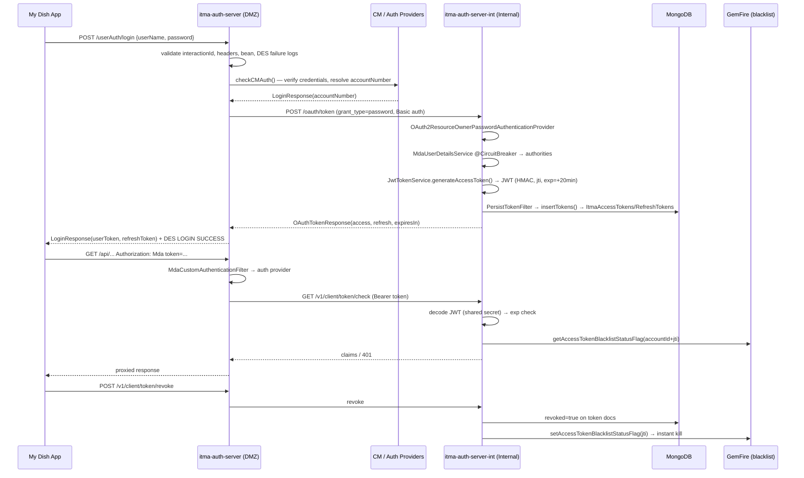

# MDA Authentication Flow — Interview Deep-Dive

The strongest end-to-end story in the codebase: **Login → Token Issuance → Token Validation → Logout**, with concrete classes, methods, and behaviors. This is the flow to walk an interviewer through.

---

## The cast (3 services, 2 data stores)

| Service | Zone | Role |
|---------|------|------|
| `itma-auth-server` (DMZ) | `mobileapps.dish.com` | Entry point: validates credentials, mints tokens via internal call |
| `itma-auth-server-int` (Internal) | `apps-int.global.dish.com` | Token Authority: issues JWT, persists to MongoDB, blacklists to GemFire |
| MongoDB | Internal | `ItmaAccessTokens` / `ItmaRefreshTokens` collections |
| Apache Geode/GemFire | Internal | `ItmaAccessTokenRevoke` / `ItmaRefreshTokenRevoke` regions (blacklist) |

Key design fact: **the DMZ service never touches the database.** That's the gateway pattern — public surface in DMZ, real work behind the firewall.

---

## Step 1 — Client hits the login endpoint (DMZ)

```
POST /userAuth/login   (itma-auth-server)
Headers: X-Interaction-ID, Customer-Facing-Tool, Device-Token, OS-Version, ...
Body:    { "userName": "...", "password": "..." }
```

**`UserAuthController.userAuthMda()`** (`UserAuthController.java:95-286`). Validation happens *before* anything else:

1. `validateInteractionId()` — UUID regex check → `ITMABadRequestException` if malformed
2. `validateRequestHeaders()` — Content-Type must be JSON or form-urlencoded (security fix against XML fallback information leakage)
3. Bean validation via injected `Validator` — `@Valid UserTO`, plus manual empty username/password checks
4. DES event logging on **every failure path**: `desUtils.desLogging("MDA_LOGIN", ..., "FAILURE", ...)` — failed logins are observable in the DES/Kafka event stream, not just app logs

Then authentication: **`userAuthService.checkCMAuth(...)`** (`UserAuthServiceImpl.java:110-278`).

---

## Step 2 — Multi-provider authentication (DMZ)

```
checkCMAuth() → cmLoginService.authenticate(CMAuthRequest) → CM (customer master)
```

**MDA doesn't authenticate passwords itself anymore.** It builds a `CMAuthRequest` and delegates to the CM (Customer Master) service, then branches on the response:

- **Fraud flag set** → block login (`"Fraud flag is true, blocking login"`)
- **Invalid credentials** → `"Invalid username or password."`
- **Account locked** → `"Account locked"`
- Success → returns `LoginResponse` with the resolved `accountNumber`

*(Historically `checkAuth()` against DISH API; legacy custom auth providers — `SynacorCustomAuthenticationProvider`, `OktaCustomAuthenticationProvider`, `DishApiCustomAuthenticationProvider`, `LdapCustomAuthenticationProvider` in `config/` — still exist for native/token flows.)*

**Interview talking point:** credential *verification* (who you are) is decoupled from token *issuance* (what you may carry). The login controller gets back a trusted `accountNumber` and never sees a password after validation.

---

## Step 3 — Token issuance: DMZ → Internal OAuth2 call

```java
// UserAuthController.java:235
oauthTokenResponse = mdaInternalService.getOAuthToken(loginResponse.getAccountNumber(), interactionId, cft);
```

**`MdaInternalServiceImpl.getOAuthToken()`** (`MdaInternalServiceImpl.java:434`):

1. Base64-encodes `mdaClientId:clientsecret`
2. Builds form-urlencoded body: `grant_type=password`, `client_id=mdaClientId`, `username=accountNumber`
3. POSTs to the internal auth server's OAuth2 token endpoint

```
itma-auth-server → POST /oauth/token  (itma-auth-server-int, internal)
```

On `itma-auth-server-int`, the endpoint is **Spring Authorization Server**: `AuthorizationServerConfig.authorizationServerSettings()` (`AuthorizationServerConfig.java:155-156`) — `tokenEndpoint("/oauth/token")`. The password grant flows through `OAuth2ResourceOwnerPasswordAuthenticationProvider`, which loads the user via `MdaUserDetailsService` — where the **circuit breaker** sits:

```java
// MdaUserDetailsService.java:56
@CircuitBreaker(name = "accountService", fallbackMethod = "getDefaultAuthorities")
public List<GrantedAuthority> getAuthoritiesFromAccount(String username) { ... }
```

If the downstream account service is down, the circuit opens and the user gets default (safe) authorities instead of a 500.

---

## Step 4 — JWT generation (internal)

**`JwtTokenService.generateAccessToken()`** (`JwtTokenService.java:36-57`):

```java
Instant now = Instant.now();
Instant expiry = now.plusSeconds(accessTokenValiditySeconds);   // 1200s = 20 min
String jti = UUID.randomUUID().toString();                       // unique token ID

JwtClaimsSet claims = JwtClaimsSet.builder()
    .issuer(issuer)                    // itma-auth-server-int
    .issuedAt(now).expiresAt(expiry)
    .subject(username)
    .id(jti)                           // JTI — the blacklist key
    .claim("user_name", username)
    .claim("client_id", issuer)
    .claim("authorities", authorityStrings)
    .claim("scope", Set.of("mda"))
    .build();

return jwtEncoder.encode(JwtEncoderParameters.from(claims)).getTokenValue();
```

Signed with HMAC-SHA256 using the **shared symmetric key** (`oauth.jwt.signingKey`) — the "zero-hop validation" design: every internal service validates the token locally without calling back to the auth server, because they all share the secret (`HmacJwkSource` provides the key to encoder/decoder).

---

## Step 5 — Token persistence to MongoDB (internal)

The clever part — **`PersistTokenFilter`** (`PersistTokenFilter.java`) is a servlet `Filter` registered around the token endpoint:

```java
filterChain.doFilter(wrappedRequest, wrappedResponse);   // run the OAuth2 endpoint first

if (uri.endsWith("/oauth/token")) {
    // decode the response payload, extract access_token + refresh_token
    // decode each JWT → pull out jti, exp
    // build ItmaTokenDTO (accountId, deviceToken, deviceModel, appVersion, jti, exp...)
    itmaTokenService.insertTokens(itmaTokenDTO, cft, interactionId, accountId);
}
```

**Token issuance and token persistence are cross-cutting concerns, not business logic in the endpoint.** The filter wraps request/response (`ContentCachingRequestWrapper`/`ContentCachingResponseWrapper`), lets the authorization server do its job, then transparently records what happened.

**`ItmaTokenServiceImpl.insertTokens()`** (`ItmaTokenServiceImpl.java:50-129`):

- Builds `ItmaAccessTokens` document → `itmaAccessTokensRepository.save()` → MongoDB
- If `fullAuthentication` (fresh login, not refresh) → also saves `ItmaRefreshTokens`
- Failure is **swallowed with a comment**: `"Ignore if any error here. This should not block the request... Possible to just extract JTI and put in GemFire"` — persistence is best-effort; the JWT itself is still valid. Degraded operation over correctness of the audit record.

Response flows back: DMZ gets `OAuthTokenResponse`; `userAuthMda()` sets `loginResponse.setUserToken(...)`, `setRefreshToken(...)`, `setExpiresIn(...)`, logs a DES `LOGIN SUCCESS` event, returns.

**Client now holds:** access token (20 min TTL) + refresh token (90 days).

---

## Step 6 — Every subsequent request: token validation

**DMZ side — `MdaCustomAuthenticationFilter`** (`MdaCustomAuthenticationFilter.java`):

```
Authorization: Mda token=<token>   (or Synacor/Okta/Ihc/Retailer/Corulo)
```

A `OncePerRequestFilter` that parses the `Authorization` header, appends `accountId`/`hhid`/`mvpd_uuid` query params to it, and hands it to the matching custom `AuthenticationProvider` (sets up `SecurityContextHolder`). Login/ping/error/password endpoints are excluded. Javadoc states the design: *"Every request to MDA must come with one of the following headers (follows RFC2617 spec)... We just need token and in case of Mda token, need accountId to validate token against the accountId."*

**Internal check — `ProxyController`** (`ProxyController.java`) converts `Mda token=` → `Bearer` and forwards to internal services, or explicitly validates via:

```
GET /v1/client/token/check?accountId=...  →  itma-auth-server-int
```

**`ItmaAuthIntController.authTokenCheck()`** (`ItmaAuthIntController.java:52-77`):

1. Rejects if no `Authorization: Bearer` header → `ITMAUnauthorizedException`
2. Strips `Bearer `, calls **`itmaTokenService.fetchAccessTokenDetails(accountId, token, ...)`**

**`ItmaTokenServiceImpl.fetchAccessTokenDetails()`** (`ItmaTokenServiceImpl.java:184-234`) — three ordered checks:

1. **Signature/parse** — `ItmaAuthIntUtil.decodeToken()` via the shared-secret `JwtDecoder` → failure throws `ITMATokenInvalidException`
2. **Expiry** — compare `exp` claim → `ITMATokenExpiredException`
3. **Blacklist** — `blacklistTokenService.getAccessTokenBlacklistStatusFlag(accountId, jti)` → **GemFire region `ItmaAccessTokenRevoke`**, keyed `accountId + jti` → blacklisted throws `ITMATokenInvalidException`

**Interview point — why GemFire for the blacklist?** Token revocation must be *immediate*: a 20-min JWT can't be recalled by signature alone, so the JTI is checked against an in-memory distributed cache for O(1) lookup on every validation, while MongoDB remains the durable record. Fast path (cache) + durable fallback.

---

## Step 7 — Logout / revocation

```
POST /v1/client/token/revoke?accountId=...&global=true/false
```

**`ItmaAuthIntController.authLogout()`** (`ItmaAuthIntController.java:130-206`) → **`ItmaTokenServiceImpl.revokeTokens()`** (`ItmaTokenServiceImpl.java:132-181`):

1. `global=true` or no device token → revoke **all** tokens for the account (`findByUsername`); else revoke by `username + deviceToken`
2. Set `revoked=true` on every matching Mongo document, `saveAll()`
3. For each revoked token: `blacklistTokenService.setAccessTokenBlacklistStatusFlag(username, jti)` → **write the JTI into the GemFire blacklist region** — the token dies immediately even though its JWT signature is still cryptographically valid
4. DES `MDA_LOGOUT` event with SUCCESS/FAILURE + device metadata

---

## The complete sequence



---

## Why this story wins in an interview

One flow demonstrates **six microservice patterns** with concrete code:

1. **API Gateway / DMZ split** — auth-server public, auth-server-int hidden; all internal calls go through one controlled hop
2. **OAuth2 / JWT token pattern** — Spring Authorization Server, password grant, short-lived access + long-lived refresh, JTI-based revocation
3. **Shared-secret zero-hop validation** — HMAC key shared across internal services; validation without network calls
4. **Circuit Breaker** — `@CircuitBreaker` on `MdaUserDetailsService.getAuthoritiesFromAccount()` with a safe fallback
5. **Cache-aside + write-through to cache** — GemFire blacklist as the fast revocation path, MongoDB as durable truth
6. **Cross-cutting concerns via filters** — `PersistTokenFilter` (audit), `MdaCustomAuthenticationFilter` (auth extraction) — persistence and auth kept out of business endpoints

Plus engineering judgment: **best-effort persistence** ("should not block the request"), **defense-in-depth validation** (UUID, content-type, bean, blacklist), **observability** (DES events on every auth outcome).

## Honest caveats (be ready for follow-ups)

- The **refresh flow** (`grant_type=refresh_token`, 90-day TTL) and **`checkCMAuth` CM handoff** were traced at signature/flow level — the full refresh-token rotation path (`fetchRefreshTokenDetails` + `LegacyRefreshTokenConverter`) is the natural follow-up question. Read `ItmaTokenServiceImpl.fetchRefreshTokenDetails()` (`ItmaTokenServiceImpl.java:284-431`) before the interview.
- **`/v1/client/token/persist`** (`ItmaAuthIntController.java:103`) is a manual persist endpoint — worth knowing why it exists alongside `PersistTokenFilter` (defensive duplication / non-OAuth flows).
